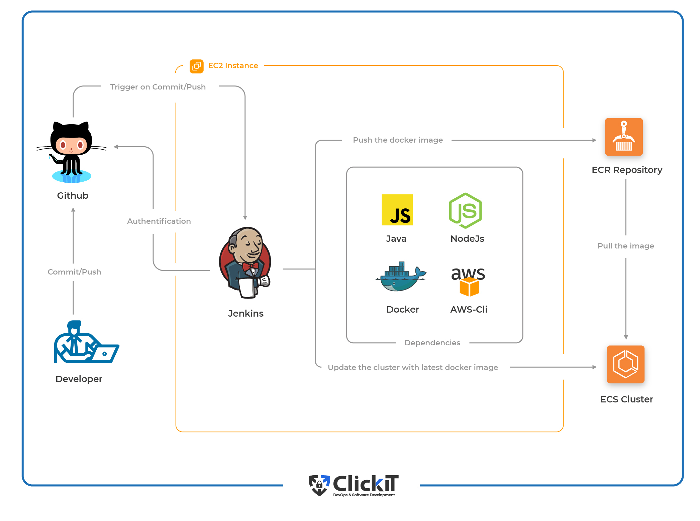

# Cloud Engineering Third Semester Examination Project

## Instruction:

A microservice-based architecture has been deployed on Kubernetes and we need to create a clear IaaC (Infrastructure as Code) deployment to be able to deploy our services in a fast manner.
 
## Setup Details
1. Provisioning an Azure voting app with nginx frontend proxy and a database backend(redis : in-memory database).

2. Provisioning the Socks Shop example microservice application 
 
### Task Instructions
- [X] Everything needs to be deployed using an Infrastructure as Code approach.
- [X]	Solution should emphasize readability, maintainability and DevOps methodologies such as:
* Deploy pipeline
* Metrics
* Monitoring
* Logging

## Tools used:
1. Prometheus - monitoring tool
2. Terraform - configuration management tool.
3. AWS 	- IaaS provider.
4. Amazon EKS - Kubernetes to run application

